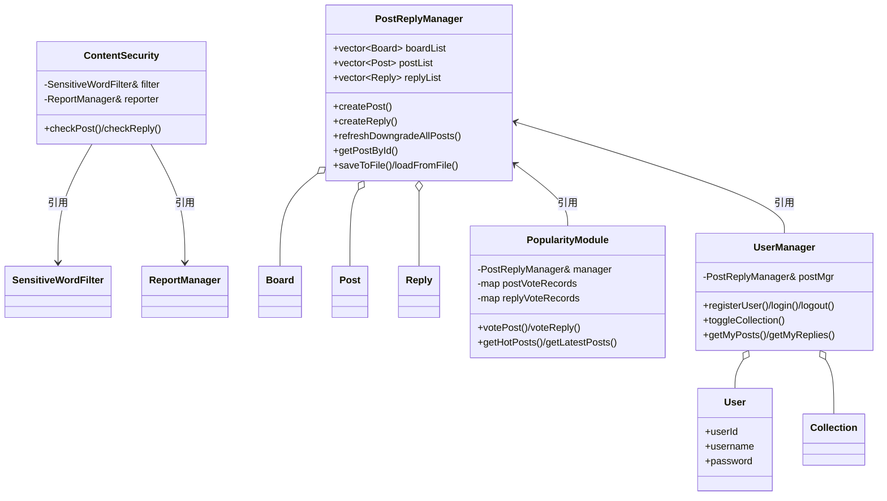

# 校园论坛系统（Campus Forum System）

> 《软件工程》课程作业 · C++ 控制台应用 · 四模块分工协作 + 主程序集成

---

## 一、项目简介

本项目是一个用标准 C++ 实现的**控制台版校园论坛系统**。系统围绕"板块 — 帖子 — 回复"这一核心业务模型展开，完整实现了发帖、回复、点赞/点踩、热帖与最新帖排行、用户注册登录、收藏、敏感词过滤、举报治理以及数据持久化等功能。

项目由 4 名成员分工开发，每人负责一个相互独立、职责清晰的模块（member1 ~ member4），各自提供头文件与实现文件；最后由 `main.cpp` 作为集成入口，把 4 个模块组装成单一可执行程序，并以统一的 30 项菜单对外提供服务。

| 项目属性 | 说明 |
|---|---|
| 编程语言 | C++（要求 C++11 及以上） |
| 运行形态 | 控制台（CLI）交互程序 |
| 外部依赖 | 无，仅使用 C++ 标准库 |
| 数据存储 | 本地文本文件（长度前缀序列化 + CSV） |
| 源文件数量 | 9 个（1 个集成入口 + 4 组模块的 .h/.cpp，member1~member4） |
| 目标平台 | Windows（主流程使用 `chcp 65001` 处理中文控制台编码），代码本身跨平台 |

---

## 二、目录结构

| 文件 | 大小 | 职责 |
|---|---|---|
| `main.cpp` | 12.8 KB | 系统集成入口：初始化各模块、渲染主菜单、分发 30 项操作、统一读写数据文件 |
| `member1.h` / `member1.cpp` | 1.9 KB / 7.9 KB | **帖子与回复管理模块**：板块、帖子、回复的数据结构与 CRUD、帖子自动降级 |
| `member2.h` / `member2.cpp` | 4.5 KB / 12.6 KB | **热度与人气模块**：帖子/回复投票、热度评分、热帖与最新帖排行 |
| `member3.h` / `member3.cpp` | 2.0 KB / 8.3 KB | **用户与收藏模块**：注册、登录、登出、收藏切换、"我的帖子/回复/收藏" |
| `member4.h` / `member4.cpp` | 1.8 KB / 18.7 KB | **内容安全模块**：敏感词过滤（含掩码）、举报与阈值标记、CSV 读写 |

运行时自动生成 / 读取的数据文件（与源码同目录，首次运行不存在时自动跳过）：

| 文件 | 生成模块 | 用途 |
|---|---|---|
| `member1_data.txt` | member1 | 板块、帖子、回复及 ID 计数器 |
| `member3_data.txt` | member3 | 用户、收藏记录及 ID 计数器 |
| `reports.csv` | member4 | 举报记录（postId, userId, reason） |
| `sensitive_words.txt` | 外部提供 | 敏感词词典（每行一个词，可选） |

---

## 三、功能总览

- **内容板块**：内置「Study」「Campus Life」「Sports & Entertainment」三个板块。
- **帖子管理**：发帖（校验板块存在、标题/正文非空）、按板块浏览可见帖、查看帖子详情（含回复列表与被举报提示）。
- **回复管理**：对存在的帖子发表回复；回复会自动"复活"已降级的帖子。
- **帖子降级（坟帖机制）**：长时间无新回复的帖子自动降级，从板块列表、热帖榜、最新帖榜中隐藏。
- **投票互动**：对帖子与回复点赞/点踩，同一用户重复点击同一种票即取消，可改票。
- **人气排行**：按加权热度公式计算得分并输出热帖排行；另有按最后回复时间排序的最新帖榜；支持查看单帖人气详情。
- **用户体系**：注册（用户名查重）、登录（设置全局登录态）、登出、查看我的帖子/回复/收藏。
- **收藏功能**：对帖子进行收藏/取消收藏切换（多用户、userId + postId 唯一）。
- **内容安全**：发帖与回复前进行敏感词检查（抗空格、标点、全角、大小写、Emoji、零宽字符等绕过手段）；命中即拦截并回显命中词；另提供掩码（`*` 替换）能力。
- **举报治理**：同一用户对同一帖只能举报一次；举报数达到阈值（默认 3）即标记该帖，并可在浏览时给出警告。
- **持久化**：帖子/回复、用户/收藏、举报记录三类数据均可手动保存与加载。

---

## 四、模块划分与职责

### 4.1 member1 — 帖子与回复管理模块

定义论坛的核心数据模型，并提供所有基础数据的读写入口，是其余三个模块的共同数据底座。

**数据结构**

| 结构体 | 关键字段 |
|---|---|
| `Board` | `boardId`、`boardName` |
| `Post` | `postId`、`boardId`、`authorUserId`、`title`、`content`、`createTime`、`lastReplyTime`、`isDowngraded` |
| `Reply` | `replyId`、`postId`、`authorUserId`、`content`、`createTime` |

**`PostReplyManager` 主要接口**

| 接口 | 说明 |
|---|---|
| `isBoardExist(boardId)` | 校验板块是否存在 |
| `refreshDowngradeAllPosts()` | 全量刷新帖子降级状态（按最后回复时间判断） |
| `createPost(boardId, authorUid, title, content)` | 发帖，成功返回新 `postId`，失败返回 -1 |
| `createReply(postId, authorUid, content)` | 回复，成功返回新 `replyId`，并刷新该帖的 `lastReplyTime`、取消降级 |
| `getBoardVisiblePosts(boardId)` | 返回该板块中未降级的帖子 |
| `getPostById(postId)` / `getRepliesOfPost(postId)` | 按 ID 取帖子 / 取帖子下全部回复 |
| `printBoards()` / `printBoardPosts()` / `printPostDetail()` | 控制台打印入口 |
| `saveToFile()` / `loadFromFile()` | 长度前缀格式的序列化与反序列化 |
| `runUnitTest()` | 模块自测（T1 ~ T6） |

**黑板容器**：`boardList`、`postList`、`replyList` 均为 `public`，便于 member2、member3 直接读取（成员 2、3 通过引用持有同一个 `PostReplyManager` 实例，共享同一份数据）。

### 4.2 member2 — 热度与人气模块

以成员 1 的 `PostReplyManager` 引用为数据源，独立维护投票记录，负责所有与"人气"相关的计算与展示。

| 结构体 | 说明 |
|---|---|
| `VoteSummary` | `likes`、`dislikes` 计票结果 |
| `HotPostResult` | 排行/详情输出载体：帖子基本信息 + 赞踩数 + 回复数 + `hotScore` + 降级状态 |

投票记录使用两级 `map`：`map<int postId, map<int userId, int vote>>`，回复投票同理（外层 key 为 `replyId`）。`vote` 取值 1（赞）/-1（踩），`votePost()`、`voteReply()` 返回值约定：**-1 失败 / 0 取消原投票 / 1 新增或改票**。

### 4.3 member3 — 用户与收藏模块

| 结构体 | 关键字段 |
|---|---|
| `User` | `userId`、`username`、`password`、`createTime` |
| `Collection` | `collectionId`、`userId`、`postId`、`collectTime` |

**登录态设计**：全局变量 `currentLoginUserId` 在 `member3.cpp` 中**唯一地定义**，并由 `member3.h` 以 `extern` 导出，供其他模块（如 member2 的投票、main 的菜单分支）直接读取当前登录用户；值为 -1 表示未登录。

`UserManager` 通过引用持有 `PostReplyManager`，其 `getMyPosts()` / `getMyReplies()` 直接遍历成员 1 的 `postList` / `replyList` 按 `authorUserId` 过滤，因此"我的帖子/回复"与主数据始终一致。

### 4.4 member4 — 内容安全模块

由三个类组成，职责逐层递进：

| 类 | 职责 |
|---|---|
| `SensitiveWordFilter` | 敏感词库管理（`loadFromFile` / `addWord`）、匹配（`findMatches`）、判定（`isClean`）、掩码（`mask`） |
| `ReportManager` | 举报受理（`report`）、计数（`getReportCount`）、阈值标记（`isMarked` / `getMarkedPosts`）、CSV 读写（`saveToFile` / `loadFromFile`） |
| `ContentSecurity` | 面向业务的门面：`checkPost` / `checkReply`（含空内容校验）、`reportPost`、`isPostMarked` |

辅助结构：`CheckResult`（allowed / message / matchedWords）、`NormalizeResult`（归一化文本 + 每个字符在原串中的起止位置）、`ReportRecord`、枚举 `ReportStatus{SUCCESS, DUPLICATE, INVALID}`。

模块末尾提供表驱动测试框架（`recordTest` + `runMember4UnitTest`），覆盖过滤器、掩码、举报、CSV、门面接口五组用例。

### 4.5 main.cpp — 集成入口

`main()` 的执行顺序：

1. `system("chcp 65001 > nul")` 切换 Windows 控制台为 UTF-8，保证中文正常显示；
2. 构造 `PostReplyManager mgr` 并 `loadFromFile("member1_data.txt")`；
3. 用 `mgr` 构造 `PopularityModule popularity` 与 `UserManager um`（共享同一数据源），并加载 `member3_data.txt`；
4. 构造 `SensitiveWordFilter filter`：先内置 8 个演示敏感词，再叠加 `sensitive_words.txt`；词典文件缺失时静默跳过；
5. 构造 `ReportManager reportMgr(3)`（举报阈值 = 3）并加载 `reports.csv`；
6. 用 `filter` 与 `reportMgr` 构造 `ContentSecurity security`；
7. 进入 30 项菜单主循环，程序退出（选项 0）前自动保存三份数据文件。

---

## 五、类关系与依赖



**依赖原则**：member2、member3 均以"引用"而非继承的方式复用 member1 的管理器，保证三者在 `main()` 中操作的是同一份内存数据；member4 与其他模块完全解耦，只依赖自身两个类，因此可独立编译与测试。

---

## 六、核心算法说明

### 6.1 帖子自动降级

```cpp
const time_t DOWNGRADE_THRESHOLD = 15;   // 单位：秒（演示用）
delta = now - post.lastReplyTime;
if (delta > DOWNGRADE_THRESHOLD) post.isDowngraded = true;
```

任何一次对帖子的读取型操作（板块列表、帖子详情、热度计算、我的帖子）前都会先调用 `refreshDowngradeAllPosts()` 全量刷新；而 `createReply()` 会把帖子的 `lastReplyTime` 更新为当前时间并清除降级标记，实现"被回复即复活"。**注意**：该阈值为教学演示取值（15 秒），实际产品应改为小时/天级并以配置项暴露。

### 6.2 帖子热度评分

热度由"互动量"与"时间衰减"两部分构成：

```
rawScore   = likes × 3.0 − dislikes × 2.0 + replyCount × 2.0
inactive   = (now − lastReplyTime) / 86400.0           // 距最后回复的天数
hotScore   = rawScore / (1 + inactive / 2.0) ^ 0.8
```

| 参数 | 取值 | 含义 |
|---|---|---|
| `likeWeight` | 3.0 | 单次点赞权重 |
| `dislikeWeight` | 2.0 | 单次点踩权重 |
| `replyWeight` | 2.0 | 单条回复权重 |
| `decayDays` | 2.0 | 衰减尺度（天） |
| `decayPower` | 0.8 | 衰减指数（<1，衰减较平缓） |

热帖榜会**剔除已降级帖子**与**得分 ≤ 0 的帖子**，排序规则为：热度降序 → 最后回复时间降序 → postId 升序；最新帖榜仅按最后回复时间降序、postId 升序排列，同样过滤降级帖。

### 6.3 敏感词匹配（抗绕过）

`normalizeText()` 先对文本做 UTF-8 逐码点解码，再统一归一化：

1. **全角转半角**：全角数字/字母 → 半角数字/小写字母；
2. **大写转小写**：`A-Z` → `a-z`；
3. **剔除分隔符**：删除 ASCII 控制符与符号、中日韩标点、全角标点、Emoji（U+1F000–U+1FAFF）、变体选择符、零宽字符等（`isSeparator()` 判定），但保留汉字、假名等实义字符；
4. 记录每个保留字符在**原字符串中的起止位置**（`NormalizeResult.startPos / endPos`），为掩码提供映射依据。

随后对归一化文本做**子串匹配**，因此 `cheat`、`che at`、`che-at`、`che.at`、`che,at`、`che　at`、`che😀at`、`che​at`、`F.U.C.K`、`ＦＵＣＫ` 等写法均可命中；非法 UTF-8 字节按原样保留而不会被丢弃。

`mask()` 依据匹配位置反向映射回原串，把命中的原始字符替换为 `*`，保证"掩码结果必然通过 `isClean()` 校验"这一自洽性。

### 6.4 举报与阈值标记

`ReportManager` 内部维护 `map<int postId, set<string> reporters>`：同一 `postId` 下用户名（去首尾空白后）唯一，重复举报返回 `DUPLICATE`，`postId <= 0` 或用户名为空返回 `INVALID`。当某帖的举报人数 `>= threshold`（`main` 中为 3）时 `isMarked()` 返回 true，浏览帖子详情（菜单 4）时会输出 `[WARNING] This post has been marked by reports.`

### 6.5 CSV 读写

- **写出**：一行一条记录，格式为 `postId,"userId","reason"`，字段统一用双引号包裹，内部 `"` 转义为 `""`，可安全承载逗号与换行。
- **读入**：手写状态机解析，支持引号内的逗号与换行、`""` 转义、CRLF/LF 混用、UTF-8 BOM 自动剥离；旧版无引号格式亦可兼容；`postId` 非正整数的脏数据行自动跳过而不报错。

---

## 七、数据文件格式

### 7.1 `member1_data.txt`（文本，长度前缀序列化）

```
板块数
  boardId
  boardName
（每个板块重复上述两行）
帖子数
  postId / boardId / authorUserId / isDowngraded(0|1) / createTime / lastReplyTime
  title   ← 先写字符数，换行，再写原文字符，换行
  content ← 同上
（每帖重复上述块）
回复数
  replyId / postId / authorUserId / createTime
  content ← 长度前缀写法
（每条回复重复上述块）
nextPostId
nextReplyId
```

字符串采用"**长度前缀**"写法（`writeStr` / `readStr`：先写 `s.size()` 换行，再用 `fin.read()` 精确读取对应字节数），因此标题与正文中的换行、空格不会被截断。

### 7.2 `member3_data.txt`

格式与上者同构：`用户数` → 每个用户的 `userId`、长度前缀的 `username` / `password`、`createTime`；`收藏数` → 每条收藏的 `collectionId / userId / postId / collectTime`；末尾为 `nextUserId`、`nextCollectionId`。

> ⚠️ 密码以**明文**形式写入该文件，仅适用于课程演示，生产环境必须改为加盐哈希。

### 7.3 `reports.csv`

```csv
7,"alice","reason,with commas"
7,"bob","normal reason"
```

首行无表头，每行 `postId,"userId","reason"`；加载时按 6.5 节规则容错解析。

### 7.4 `sensitive_words.txt`

UTF-8 纯文本，**每行一个敏感词**，空行与以 `#` 开头的注释行被忽略。该文件可选；缺失时程序仅使用 `main.cpp` 中内置的演示词表。

---

## 八、编译与运行

### 8.1 命令行（MinGW-w64 / MSYS2 / g++）

```bash
g++ -std=c++11 -O2 -o forum.exe main.cpp member1.cpp member2.cpp member3.cpp member4.cpp
./forum.exe
```

如使用 Linux / macOS：

```bash
g++ -std=c++11 -O2 -o forum main.cpp member1.cpp member2.cpp member3.cpp member4.cpp
./forum
```

**注意事项**

- 5 个 `.cpp` 必须**一起编译链接**，不能只编译 `main.cpp`（否则会出现 `undefined reference`）。
- 至少需要 **C++11**：代码用到了 `enum class`、`auto`、范围 `for`、Lambda、`stoi`、`nullptr`、成员默认初始化等特性。
- 源文件请以 **UTF-8** 编码保存；`main.cpp` 已通过 `system("chcp 65001 > nul")` 处理 Windows 控制台中文乱码（该调用在非 Windows 平台无副作用地失败或无输出）。
- 数据文件按**相对路径**读写，请在可执行文件所在目录下运行。

### 8.2 Dev-C++ / Code::Blocks

新建 Console Application 项目，把 5 个 `.cpp` 与 4 个 `.h` 全部加入项目后直接编译运行；编译器选项选择 `-std=c++11`（或更高）。

### 8.3 Visual Studio

新建"空项目"，将全部源文件添加到项目中，在 **项目属性 → C/C++ → 命令行** 中添加 `/utf-8`，并确保 C++ 语言标准为 C++11 或以上。

---

## 九、主菜单功能对照表

程序启动后显示 `=====【Main Menu｜Integrated System】=====`，输入序号执行对应操作，`0` 退出。

| 序号 | 功能 | 所属模块 |
|---|---|---|
| 1 | 查看板块列表 | member1 |
| 2 | 发帖（含敏感词检查） | member1 + member4 |
| 3 | 查看某板块可见帖子（已过滤降级帖） | member1 |
| 4 | 查看帖子详情（含降级帖与被举报提醒） | member1 + member4 |
| 5 | 添加回复（含敏感词检查） | member1 + member4 |
| 6 | 运行 member1 单元测试 | member1 |
| 7 / 8 | 保存 / 加载帖子数据 | member1 |
| 9 | 帖子点赞或点踩 | member2 |
| 10 | 回复点赞或点踩 | member2 |
| 11 | 查看热帖排行（可限定板块，-1 为全部） | member2 |
| 12 | 查看最新帖子 | member2 |
| 13 | 查看单个帖子人气 | member2 |
| 14 | 注册用户 | member3 |
| 15 | 登录 | member3 |
| 16 | 登出 | member3 |
| 17 | 收藏 / 取消收藏帖子 | member3 |
| 18 | 查看我的帖子 | member3 |
| 19 | 查看我的回复 | member3 |
| 20 | 查看我的收藏 | member3 |
| 21 / 22 | 保存 / 加载用户数据 | member3 |
| 23 | 运行 member3 单元测试 | member3 |
| 24 | 敏感词检查（帖子标题+正文） | member4 |
| 25 | 敏感词检查（回复内容） | member4 |
| 26 | 举报帖子 | member4 |
| 27 | 查看被标记的帖子 | member4 |
| 28 / 29 | 保存 / 加载举报数据 | member4 |
| 30 | 运行 member4 单元测试 | member4 |
| 0 | 退出（退出前自动保存全部数据） | main |

**使用顺序建议**：先执行 15 登录（或 14 注册后再登录），再使用 9 / 10 投票与 17 收藏、18~20 查询个人数据——投票与收藏依赖登录态（未登录时提示 `Please login first.`）。

---

## 十、单元测试

| 入口 | 覆盖内容 |
|---|---|
| 菜单 6（`PostReplyManager::runUnitTest`） | T1 合法板块发帖成功；T2 非法板块 ID 被拒；T3 回复不存在的帖子被拒；T4 新帖初始未降级；T5 超过阈值后自动降级（**会实际等待约 16 秒**）；T6 新回复使帖子复活 |
| 菜单 23（`UserManager::runUnitTest`） | 正常注册成功；重名注册被拒；登录成功且全局登录态被正确设置；错误密码登录被拒且登录态保持 -1 |
| 菜单 30（`runMember4UnitTest`） | 表驱动测试，逐条打印 `PASS/FAIL / 编号 / 类别 / 输入 / 期望 / 实际`，覆盖过滤器（含各类分隔符绕过、非法 UTF-8）、掩码与掩码自洽性、举报规则、CSV 往返与脏数据容错、门面接口，末尾汇总通过/失败数量 |

member2 未提供独立测试入口，其投票与排行逻辑通过菜单 9 ~ 13 手动验证。

---

## 十一、已知限制与可改进方向

| 项 | 说明 |
|---|---|
| 密码明文存储 | `member3_data.txt` 中密码为明文，应改为加盐哈希（如 bcrypt） |
| 降级阈值过短 | `DOWNGRADE_THRESHOLD = 15`（秒）为演示取值，且为编译期常量，宜改为可配置的小时/天级参数 |
| 投票数据未持久化 | member2 已提供 `getPostVoteRecords()` / `loadPostVote()` 等接口，但 `main.cpp` 的保存/加载只覆盖帖子、用户与举报三类数据，退出后投票记录会丢失 |
| 登录态与发帖未完全打通 | 发帖（菜单 2）与回复（菜单 5）仍要求手动输入作者 ID（提示为 "Passed from login module"），未直接取用 `currentLoginUserId` |
| 敏感词为子串匹配 | 归一化后做子串匹配，可能对"词内恰好包含敏感词"的正常文本产生误判，可引入词边界或分词策略 |
| 内存数据规模 | 板块、帖子、回复、用户均存于 `vector`，采用线性查找，适合课程规模；数据量大时应改用索引或数据库 |
| 无并发保护 | 全局登录态与共享管理器均无锁，仅适用于单线程控制台场景 |

---

## 十二、版本与分工

| 模块 | 负责人 | 主要产出 |
|---|---|---|
| member1 | 成员 1 | 板块/帖子/回复模型与降级机制、持久化 |
| member2 | 成员 2 | 投票、热度算法、热帖与最新帖排行 |
| member3 | 成员 3 | 用户注册登录、全局登录态、收藏与个人中心 |
| member4 | 成员 4 | 敏感词过滤与掩码、举报治理、CSV 读写 |
| 集成 | 全体 | `main.cpp` 菜单集成、联调与数据文件约定 |

> 本文档依据仓库中 9 个源文件（`main.cpp` 与 `member1` ~ `member4` 的 `.h` / `.cpp`）的实际实现整理，算法参数、接口名、菜单项与数据格式均与源码一一对应。
*（内容由AI生成，仅供参考）*
